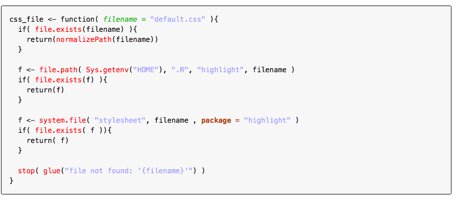

highlight
=========

highlight is a syntax highlighter for R code.

Installation
------------

You can install highlight from github with:

``` r
# install.packages("devtools")
devtools::install_github("romainfrancois/highlight")
```

Typical highlighting (lestrade)
-------------------------------

Typical syntax highlighting is only interested in whether a token is a function call, a keyword, a string, ... this is what the `lestrade` detective does:

``` r
highlight( file = "css_file.R", detective = lestrade )
```

This will look like this:



This differentiates <span class="functioncall">function calls</span>, <span class="symbol_formalargs">formal arguments</span>, <span class="symbol_argument">used arguments</span> ... because `lestrade` identified these tokens as such.

semantic highlighting (sherlock)
--------------------------------

Traditional highlighting only reveals the obvious, so the package also benefits from the investigation of `sherlock` for semantic highlighting. In semantic highlighting, every symbol gets a different color.

``` r
highlight( file = "css_file.R", detective = sherlock )
```


With this we can quickly skim through the file and see e.g. the different uses of `filename`.

In rmarkdown
------------

To use in `rmarkdown` you can use the `hl_hook_source` and `hl_hook_document` hooks.

``` r
knitr::knit_hooks$set( 
  source = hl_hook_source, 
  document = hl_hook_css
)
```
